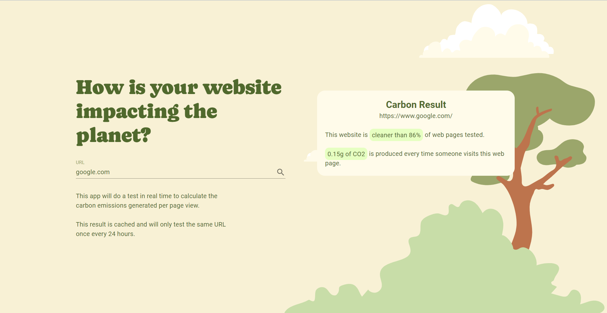

# Website Carbon Emissions Calculator

This is a React application that allows you to calculate the carbon emissions generated by loading a web page. It
utilizes the [Website Carbon API](https://www.websitecarbon.com/) to estimate the environmental impact of a given URL.

## Preview


## Features

- Real-time calculation of carbon emissions per page view.
- Simple and intuitive user interface.
- Layout responsiveness.

## Technologies Used

- React: JavaScript library for building user interfaces.
- Vite: Fast and lightweight build tool for modern web applications.
- TypeScript: Typed superset of JavaScript for improved development experience.
- Material UI: Component library for styling and UI elements.
- Axios: Promise-based HTTP client for making API requests.
- React Query: Data fetching and caching library for React applications.

## Quick Start

```
git clone https://github.com/stevelukis/website-carbon.git
cd website-carbon
pnpm install
pnpm run dev
```

## Contributing

Contributions are welcome! If you have any suggestions, bug reports, or feature requests, please open an issue or submit
a pull request.

## License

This project is licensed under the MIT License.

## Acknowledgements

This project utilizes the Website Carbon API. [Visit their website](https://www.websitecarbon.com/) for more information.
